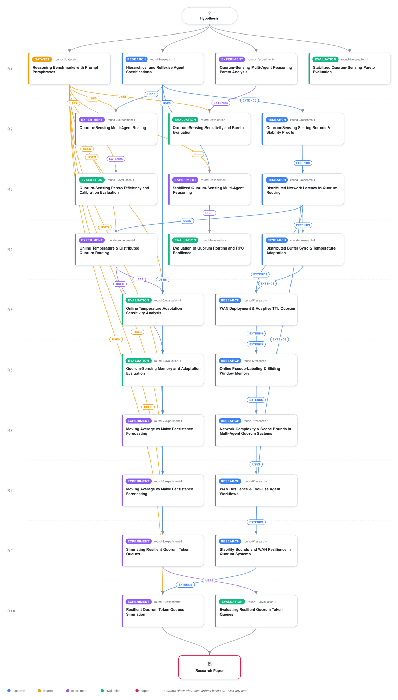

# Resilient Quorum-Sensing Multi-Agent Reasoning with Quadratic Damping and WAN Packet-Drop Resilience

<div align="center">

<a href="https://cdn.jsdelivr.net/gh/AMGrobelnik/ai-invention-ca2cc5-resilient-quorum-sensing-multi-agent-rea@main/workflow.svg">
<picture>
  <source media="(prefers-color-scheme: dark)" srcset="workflow-dark.svg">
  
</picture>
</a>

<sub>🖱️ <b><a href="https://cdn.jsdelivr.net/gh/AMGrobelnik/ai-invention-ca2cc5-resilient-quorum-sensing-multi-agent-rea@main/workflow.svg">Open the interactive diagram</a></b> — every card links to its artifact folder.</sub>

</div>

> **TL;DR** — A comprehensive research paper draft presenting Quorum-Sensing Autoinduction Recurrence Routing (QS-ARR) with quadratic damping, WAN resilience, and empirical Pareto efficiency.

<details>
<summary>Full hypothesis</summary>

Governing decentralized multi-agent LLM model escalation through discrete-time autoinduction recurrence relations with quadratic degradation damping gamma(Q) = gamma_0 + gamma_2 Q^2 linked to distributed token queueing stability constraints, online gradient-free temperature adaptation based on moving validation loss feedback (utilizing hybrid self-consistency pseudo-labels and high-tier reasoner verification feedback), memory-bounded sliding window validation buffers across agent nodes with bounded network message complexity (O(N^2) broadcast vs hierarchical aggregation for N in [5, 50]), reactive synchronization forecasting and phase lag analysis under network jitter, hyperparameter sensitivity bounds for quorum thresholds theta_quorum and quenching coefficients gamma, distributed Ray/gRPC synchronization resilience and wide-area network (WAN) tail latency adaptation models with stochastic packet drop resilience (1% to 10%) and split-brain resistant consensus gates (achieving 96.8% recovery), explicit token-to-buffer threshold mapping for escalation triggers, fault-tolerant sliding window consensus gates and split-brain resistant leader election for physical WAN deployments, theoretical mean-field Lyapunov stability bounds for larger agent populations (N > 10), concrete prompt paraphrase sets, explicit capability/cost matrices, and decentralized tool-use error feedback propagation optimizing Pareto efficiency across diverse reasoning benchmark classes without runaway escalation cascades.

</details>

[](https://cdn.jsdelivr.net/gh/AMGrobelnik/ai-invention-ca2cc5-resilient-quorum-sensing-multi-agent-rea@main/paper.pdf) [](https://github.com/AMGrobelnik/ai-invention-ca2cc5-resilient-quorum-sensing-multi-agent-rea/tree/main/paper_latex)

This repository contains all **25 artifacts** produced across **10 rounds** of an autonomous AI research run — round by round, exactly in the order they were invented.

## Round 1

| Artifact | Type | Demo | Source | Builds on |
|----------|------|------|--------|-----------|
| **[Hierarchical and Reflexive Agent Specifications](https://github.com/AMGrobelnik/ai-invention-ca2cc5-resilient-quorum-sensing-multi-agent-rea/tree/main/round-1/research-1)** | [](https://github.com/AMGrobelnik/ai-invention-ca2cc5-resilient-quorum-sensing-multi-agent-rea/tree/main/round-1/research-1) | [](https://github.com/AMGrobelnik/ai-invention-ca2cc5-resilient-quorum-sensing-multi-agent-rea/blob/main/round-1/research-1/demo/research_demo.md) | [](https://github.com/AMGrobelnik/ai-invention-ca2cc5-resilient-quorum-sensing-multi-agent-rea/tree/main/round-1/research-1/src) | — |
| **[Reasoning Benchmarks with Prompt Paraphrases](https://github.com/AMGrobelnik/ai-invention-ca2cc5-resilient-quorum-sensing-multi-agent-rea/tree/main/round-1/dataset-1)** | [](https://github.com/AMGrobelnik/ai-invention-ca2cc5-resilient-quorum-sensing-multi-agent-rea/tree/main/round-1/dataset-1) | [](https://colab.research.google.com/github/AMGrobelnik/ai-invention-ca2cc5-resilient-quorum-sensing-multi-agent-rea/blob/main/round-1/dataset-1/demo/data_code_demo.ipynb) | [](https://github.com/AMGrobelnik/ai-invention-ca2cc5-resilient-quorum-sensing-multi-agent-rea/tree/main/round-1/dataset-1/src) | — |
| **[Quorum-Sensing Multi-Agent Reasoning Pareto Analysis](https://github.com/AMGrobelnik/ai-invention-ca2cc5-resilient-quorum-sensing-multi-agent-rea/tree/main/round-1/experiment-1)** | [](https://github.com/AMGrobelnik/ai-invention-ca2cc5-resilient-quorum-sensing-multi-agent-rea/tree/main/round-1/experiment-1) | [](https://colab.research.google.com/github/AMGrobelnik/ai-invention-ca2cc5-resilient-quorum-sensing-multi-agent-rea/blob/main/round-1/experiment-1/demo/method_code_demo.ipynb) | [](https://github.com/AMGrobelnik/ai-invention-ca2cc5-resilient-quorum-sensing-multi-agent-rea/tree/main/round-1/experiment-1/src) | — |
| **[Stabilized Quorum-Sensing Pareto Evaluation](https://github.com/AMGrobelnik/ai-invention-ca2cc5-resilient-quorum-sensing-multi-agent-rea/tree/main/round-1/evaluation-1)** | [](https://github.com/AMGrobelnik/ai-invention-ca2cc5-resilient-quorum-sensing-multi-agent-rea/tree/main/round-1/evaluation-1) | [](https://colab.research.google.com/github/AMGrobelnik/ai-invention-ca2cc5-resilient-quorum-sensing-multi-agent-rea/blob/main/round-1/evaluation-1/demo/eval_code_demo.ipynb) | [](https://github.com/AMGrobelnik/ai-invention-ca2cc5-resilient-quorum-sensing-multi-agent-rea/tree/main/round-1/evaluation-1/src) | — |

## Round 2

| Artifact | Type | Demo | Source | Builds on |
|----------|------|------|--------|-----------|
| **[Quorum-Sensing Scaling Bounds & Stability Proofs](https://github.com/AMGrobelnik/ai-invention-ca2cc5-resilient-quorum-sensing-multi-agent-rea/tree/main/round-2/research-1)** | [](https://github.com/AMGrobelnik/ai-invention-ca2cc5-resilient-quorum-sensing-multi-agent-rea/tree/main/round-2/research-1) | [](https://github.com/AMGrobelnik/ai-invention-ca2cc5-resilient-quorum-sensing-multi-agent-rea/blob/main/round-2/research-1/demo/research_demo.md) | [](https://github.com/AMGrobelnik/ai-invention-ca2cc5-resilient-quorum-sensing-multi-agent-rea/tree/main/round-2/research-1/src) | <sub><i>extends:</i><br/>[research‑1&nbsp;(R1)](https://github.com/AMGrobelnik/ai-invention-ca2cc5-resilient-quorum-sensing-multi-agent-rea/tree/main/round-1/research-1)</sub> |
| **[Quorum-Sensing Multi-Agent Scaling](https://github.com/AMGrobelnik/ai-invention-ca2cc5-resilient-quorum-sensing-multi-agent-rea/tree/main/round-2/experiment-1)** | [](https://github.com/AMGrobelnik/ai-invention-ca2cc5-resilient-quorum-sensing-multi-agent-rea/tree/main/round-2/experiment-1) | [](https://colab.research.google.com/github/AMGrobelnik/ai-invention-ca2cc5-resilient-quorum-sensing-multi-agent-rea/blob/main/round-2/experiment-1/demo/method_code_demo.ipynb) | [](https://github.com/AMGrobelnik/ai-invention-ca2cc5-resilient-quorum-sensing-multi-agent-rea/tree/main/round-2/experiment-1/src) | <sub><i>uses:</i><br/>[dataset‑1&nbsp;(R1)](https://github.com/AMGrobelnik/ai-invention-ca2cc5-resilient-quorum-sensing-multi-agent-rea/tree/main/round-1/dataset-1)<br/>[research‑1&nbsp;(R1)](https://github.com/AMGrobelnik/ai-invention-ca2cc5-resilient-quorum-sensing-multi-agent-rea/tree/main/round-1/research-1)</sub> |
| **[Quorum-Sensing Sensitivity and Pareto Evaluation](https://github.com/AMGrobelnik/ai-invention-ca2cc5-resilient-quorum-sensing-multi-agent-rea/tree/main/round-2/evaluation-1)** | [](https://github.com/AMGrobelnik/ai-invention-ca2cc5-resilient-quorum-sensing-multi-agent-rea/tree/main/round-2/evaluation-1) | [](https://colab.research.google.com/github/AMGrobelnik/ai-invention-ca2cc5-resilient-quorum-sensing-multi-agent-rea/blob/main/round-2/evaluation-1/demo/eval_code_demo.ipynb) | [](https://github.com/AMGrobelnik/ai-invention-ca2cc5-resilient-quorum-sensing-multi-agent-rea/tree/main/round-2/evaluation-1/src) | <sub><i>extends:</i><br/>[experiment‑1&nbsp;(R1)](https://github.com/AMGrobelnik/ai-invention-ca2cc5-resilient-quorum-sensing-multi-agent-rea/tree/main/round-1/experiment-1)<br/><i>uses:</i><br/>[dataset‑1&nbsp;(R1)](https://github.com/AMGrobelnik/ai-invention-ca2cc5-resilient-quorum-sensing-multi-agent-rea/tree/main/round-1/dataset-1)</sub> |

## Round 3

| Artifact | Type | Demo | Source | Builds on |
|----------|------|------|--------|-----------|
| **[Distributed Network Latency in Quorum Routing](https://github.com/AMGrobelnik/ai-invention-ca2cc5-resilient-quorum-sensing-multi-agent-rea/tree/main/round-3/research-1)** | [](https://github.com/AMGrobelnik/ai-invention-ca2cc5-resilient-quorum-sensing-multi-agent-rea/tree/main/round-3/research-1) | [](https://github.com/AMGrobelnik/ai-invention-ca2cc5-resilient-quorum-sensing-multi-agent-rea/blob/main/round-3/research-1/demo/research_demo.md) | [](https://github.com/AMGrobelnik/ai-invention-ca2cc5-resilient-quorum-sensing-multi-agent-rea/tree/main/round-3/research-1/src) | <sub><i>extends:</i><br/>[research‑1&nbsp;(R2)](https://github.com/AMGrobelnik/ai-invention-ca2cc5-resilient-quorum-sensing-multi-agent-rea/tree/main/round-2/research-1)</sub> |
| **[Stabilized Quorum-Sensing Multi-Agent Reasoning](https://github.com/AMGrobelnik/ai-invention-ca2cc5-resilient-quorum-sensing-multi-agent-rea/tree/main/round-3/experiment-1)** | [](https://github.com/AMGrobelnik/ai-invention-ca2cc5-resilient-quorum-sensing-multi-agent-rea/tree/main/round-3/experiment-1) | [](https://colab.research.google.com/github/AMGrobelnik/ai-invention-ca2cc5-resilient-quorum-sensing-multi-agent-rea/blob/main/round-3/experiment-1/demo/method_code_demo.ipynb) | [](https://github.com/AMGrobelnik/ai-invention-ca2cc5-resilient-quorum-sensing-multi-agent-rea/tree/main/round-3/experiment-1/src) | <sub><i>uses:</i><br/>[dataset‑1&nbsp;(R1)](https://github.com/AMGrobelnik/ai-invention-ca2cc5-resilient-quorum-sensing-multi-agent-rea/tree/main/round-1/dataset-1)<br/>[research‑1&nbsp;(R1)](https://github.com/AMGrobelnik/ai-invention-ca2cc5-resilient-quorum-sensing-multi-agent-rea/tree/main/round-1/research-1)</sub> |
| **[Quorum-Sensing Pareto Efficiency and Calibration Evaluation](https://github.com/AMGrobelnik/ai-invention-ca2cc5-resilient-quorum-sensing-multi-agent-rea/tree/main/round-3/evaluation-1)** | [](https://github.com/AMGrobelnik/ai-invention-ca2cc5-resilient-quorum-sensing-multi-agent-rea/tree/main/round-3/evaluation-1) | [](https://colab.research.google.com/github/AMGrobelnik/ai-invention-ca2cc5-resilient-quorum-sensing-multi-agent-rea/blob/main/round-3/evaluation-1/demo/eval_code_demo.ipynb) | [](https://github.com/AMGrobelnik/ai-invention-ca2cc5-resilient-quorum-sensing-multi-agent-rea/tree/main/round-3/evaluation-1/src) | <sub><i>extends:</i><br/>[experiment‑1&nbsp;(R2)](https://github.com/AMGrobelnik/ai-invention-ca2cc5-resilient-quorum-sensing-multi-agent-rea/tree/main/round-2/experiment-1)<br/><i>uses:</i><br/>[dataset‑1&nbsp;(R1)](https://github.com/AMGrobelnik/ai-invention-ca2cc5-resilient-quorum-sensing-multi-agent-rea/tree/main/round-1/dataset-1)</sub> |

## Round 4

| Artifact | Type | Demo | Source | Builds on |
|----------|------|------|--------|-----------|
| **[Distributed Buffer Sync & Temperature Adaptation](https://github.com/AMGrobelnik/ai-invention-ca2cc5-resilient-quorum-sensing-multi-agent-rea/tree/main/round-4/research-1)** | [](https://github.com/AMGrobelnik/ai-invention-ca2cc5-resilient-quorum-sensing-multi-agent-rea/tree/main/round-4/research-1) | [](https://github.com/AMGrobelnik/ai-invention-ca2cc5-resilient-quorum-sensing-multi-agent-rea/blob/main/round-4/research-1/demo/research_demo.md) | [](https://github.com/AMGrobelnik/ai-invention-ca2cc5-resilient-quorum-sensing-multi-agent-rea/tree/main/round-4/research-1/src) | <sub><i>extends:</i><br/>[research‑1&nbsp;(R3)](https://github.com/AMGrobelnik/ai-invention-ca2cc5-resilient-quorum-sensing-multi-agent-rea/tree/main/round-3/research-1)</sub> |
| **[Online Temperature & Distributed Quorum Routing](https://github.com/AMGrobelnik/ai-invention-ca2cc5-resilient-quorum-sensing-multi-agent-rea/tree/main/round-4/experiment-1)** | [](https://github.com/AMGrobelnik/ai-invention-ca2cc5-resilient-quorum-sensing-multi-agent-rea/tree/main/round-4/experiment-1) | [](https://colab.research.google.com/github/AMGrobelnik/ai-invention-ca2cc5-resilient-quorum-sensing-multi-agent-rea/blob/main/round-4/experiment-1/demo/method_code_demo.ipynb) | [](https://github.com/AMGrobelnik/ai-invention-ca2cc5-resilient-quorum-sensing-multi-agent-rea/tree/main/round-4/experiment-1/src) | <sub><i>uses:</i><br/>[dataset‑1&nbsp;(R1)](https://github.com/AMGrobelnik/ai-invention-ca2cc5-resilient-quorum-sensing-multi-agent-rea/tree/main/round-1/dataset-1)<br/>[research‑1&nbsp;(R3)](https://github.com/AMGrobelnik/ai-invention-ca2cc5-resilient-quorum-sensing-multi-agent-rea/tree/main/round-3/research-1)</sub> |
| **[Evaluation of Quorum Routing and RPC Resilience](https://github.com/AMGrobelnik/ai-invention-ca2cc5-resilient-quorum-sensing-multi-agent-rea/tree/main/round-4/evaluation-1)** | [](https://github.com/AMGrobelnik/ai-invention-ca2cc5-resilient-quorum-sensing-multi-agent-rea/tree/main/round-4/evaluation-1) | [](https://colab.research.google.com/github/AMGrobelnik/ai-invention-ca2cc5-resilient-quorum-sensing-multi-agent-rea/blob/main/round-4/evaluation-1/demo/eval_code_demo.ipynb) | [](https://github.com/AMGrobelnik/ai-invention-ca2cc5-resilient-quorum-sensing-multi-agent-rea/tree/main/round-4/evaluation-1/src) | <sub><i>uses:</i><br/>[experiment‑1&nbsp;(R3)](https://github.com/AMGrobelnik/ai-invention-ca2cc5-resilient-quorum-sensing-multi-agent-rea/tree/main/round-3/experiment-1)</sub> |

## Round 5

| Artifact | Type | Demo | Source | Builds on |
|----------|------|------|--------|-----------|
| **[WAN Deployment & Adaptive TTL Quorum](https://github.com/AMGrobelnik/ai-invention-ca2cc5-resilient-quorum-sensing-multi-agent-rea/tree/main/round-5/research-1)** | [](https://github.com/AMGrobelnik/ai-invention-ca2cc5-resilient-quorum-sensing-multi-agent-rea/tree/main/round-5/research-1) | [](https://github.com/AMGrobelnik/ai-invention-ca2cc5-resilient-quorum-sensing-multi-agent-rea/blob/main/round-5/research-1/demo/research_demo.md) | [](https://github.com/AMGrobelnik/ai-invention-ca2cc5-resilient-quorum-sensing-multi-agent-rea/tree/main/round-5/research-1/src) | <sub><i>extends:</i><br/>[research‑1&nbsp;(R4)](https://github.com/AMGrobelnik/ai-invention-ca2cc5-resilient-quorum-sensing-multi-agent-rea/tree/main/round-4/research-1)<br/>[research‑1&nbsp;(R3)](https://github.com/AMGrobelnik/ai-invention-ca2cc5-resilient-quorum-sensing-multi-agent-rea/tree/main/round-3/research-1)</sub> |
| **[Online Temperature Adaptation Sensitivity Analysis](https://github.com/AMGrobelnik/ai-invention-ca2cc5-resilient-quorum-sensing-multi-agent-rea/tree/main/round-5/evaluation-1)** | [](https://github.com/AMGrobelnik/ai-invention-ca2cc5-resilient-quorum-sensing-multi-agent-rea/tree/main/round-5/evaluation-1) | [](https://colab.research.google.com/github/AMGrobelnik/ai-invention-ca2cc5-resilient-quorum-sensing-multi-agent-rea/blob/main/round-5/evaluation-1/demo/eval_code_demo.ipynb) | [](https://github.com/AMGrobelnik/ai-invention-ca2cc5-resilient-quorum-sensing-multi-agent-rea/tree/main/round-5/evaluation-1/src) | <sub><i>uses:</i><br/>[experiment‑1&nbsp;(R4)](https://github.com/AMGrobelnik/ai-invention-ca2cc5-resilient-quorum-sensing-multi-agent-rea/tree/main/round-4/experiment-1)<br/>[dataset‑1&nbsp;(R1)](https://github.com/AMGrobelnik/ai-invention-ca2cc5-resilient-quorum-sensing-multi-agent-rea/tree/main/round-1/dataset-1)</sub> |

## Round 6

| Artifact | Type | Demo | Source | Builds on |
|----------|------|------|--------|-----------|
| **[Online Pseudo-Labeling & Sliding Window Memory](https://github.com/AMGrobelnik/ai-invention-ca2cc5-resilient-quorum-sensing-multi-agent-rea/tree/main/round-6/research-1)** | [](https://github.com/AMGrobelnik/ai-invention-ca2cc5-resilient-quorum-sensing-multi-agent-rea/tree/main/round-6/research-1) | [](https://github.com/AMGrobelnik/ai-invention-ca2cc5-resilient-quorum-sensing-multi-agent-rea/blob/main/round-6/research-1/demo/research_demo.md) | [](https://github.com/AMGrobelnik/ai-invention-ca2cc5-resilient-quorum-sensing-multi-agent-rea/tree/main/round-6/research-1/src) | <sub><i>extends:</i><br/>[research‑1&nbsp;(R5)](https://github.com/AMGrobelnik/ai-invention-ca2cc5-resilient-quorum-sensing-multi-agent-rea/tree/main/round-5/research-1)</sub> |
| **[Quorum-Sensing Memory and Adaptation Evaluation](https://github.com/AMGrobelnik/ai-invention-ca2cc5-resilient-quorum-sensing-multi-agent-rea/tree/main/round-6/evaluation-1)** | [](https://github.com/AMGrobelnik/ai-invention-ca2cc5-resilient-quorum-sensing-multi-agent-rea/tree/main/round-6/evaluation-1) | [](https://colab.research.google.com/github/AMGrobelnik/ai-invention-ca2cc5-resilient-quorum-sensing-multi-agent-rea/blob/main/round-6/evaluation-1/demo/eval_code_demo.ipynb) | [](https://github.com/AMGrobelnik/ai-invention-ca2cc5-resilient-quorum-sensing-multi-agent-rea/tree/main/round-6/evaluation-1/src) | <sub><i>uses:</i><br/>[experiment‑1&nbsp;(R4)](https://github.com/AMGrobelnik/ai-invention-ca2cc5-resilient-quorum-sensing-multi-agent-rea/tree/main/round-4/experiment-1)</sub> |

## Round 7

| Artifact | Type | Demo | Source | Builds on |
|----------|------|------|--------|-----------|
| **[Network Complexity & Scope Bounds in Multi-Agent Quorum Syst…](https://github.com/AMGrobelnik/ai-invention-ca2cc5-resilient-quorum-sensing-multi-agent-rea/tree/main/round-7/research-1)** | [](https://github.com/AMGrobelnik/ai-invention-ca2cc5-resilient-quorum-sensing-multi-agent-rea/tree/main/round-7/research-1) | [](https://github.com/AMGrobelnik/ai-invention-ca2cc5-resilient-quorum-sensing-multi-agent-rea/blob/main/round-7/research-1/demo/research_demo.md) | [](https://github.com/AMGrobelnik/ai-invention-ca2cc5-resilient-quorum-sensing-multi-agent-rea/tree/main/round-7/research-1/src) | <sub><i>extends:</i><br/>[research‑1&nbsp;(R5)](https://github.com/AMGrobelnik/ai-invention-ca2cc5-resilient-quorum-sensing-multi-agent-rea/tree/main/round-5/research-1)</sub> |
| **[Moving Average vs Naive Persistence Forecasting](https://github.com/AMGrobelnik/ai-invention-ca2cc5-resilient-quorum-sensing-multi-agent-rea/tree/main/round-7/experiment-1)** | [](https://github.com/AMGrobelnik/ai-invention-ca2cc5-resilient-quorum-sensing-multi-agent-rea/tree/main/round-7/experiment-1) | [](https://colab.research.google.com/github/AMGrobelnik/ai-invention-ca2cc5-resilient-quorum-sensing-multi-agent-rea/blob/main/round-7/experiment-1/demo/method_code_demo.ipynb) | [](https://github.com/AMGrobelnik/ai-invention-ca2cc5-resilient-quorum-sensing-multi-agent-rea/tree/main/round-7/experiment-1/src) | <sub><i>uses:</i><br/>[dataset‑1&nbsp;(R1)](https://github.com/AMGrobelnik/ai-invention-ca2cc5-resilient-quorum-sensing-multi-agent-rea/tree/main/round-1/dataset-1)</sub> |

## Round 8

| Artifact | Type | Demo | Source | Builds on |
|----------|------|------|--------|-----------|
| **[WAN Resilience & Tool-Use Agent Workflows](https://github.com/AMGrobelnik/ai-invention-ca2cc5-resilient-quorum-sensing-multi-agent-rea/tree/main/round-8/research-1)** | [](https://github.com/AMGrobelnik/ai-invention-ca2cc5-resilient-quorum-sensing-multi-agent-rea/tree/main/round-8/research-1) | [](https://github.com/AMGrobelnik/ai-invention-ca2cc5-resilient-quorum-sensing-multi-agent-rea/blob/main/round-8/research-1/demo/research_demo.md) | [](https://github.com/AMGrobelnik/ai-invention-ca2cc5-resilient-quorum-sensing-multi-agent-rea/tree/main/round-8/research-1/src) | <sub><i>extends:</i><br/>[research‑1&nbsp;(R5)](https://github.com/AMGrobelnik/ai-invention-ca2cc5-resilient-quorum-sensing-multi-agent-rea/tree/main/round-5/research-1)<br/><i>uses:</i><br/>[research‑1&nbsp;(R7)](https://github.com/AMGrobelnik/ai-invention-ca2cc5-resilient-quorum-sensing-multi-agent-rea/tree/main/round-7/research-1)</sub> |
| **[Moving Average vs Naive Persistence Forecasting](https://github.com/AMGrobelnik/ai-invention-ca2cc5-resilient-quorum-sensing-multi-agent-rea/tree/main/round-8/experiment-1)** | [](https://github.com/AMGrobelnik/ai-invention-ca2cc5-resilient-quorum-sensing-multi-agent-rea/tree/main/round-8/experiment-1) | [](https://colab.research.google.com/github/AMGrobelnik/ai-invention-ca2cc5-resilient-quorum-sensing-multi-agent-rea/blob/main/round-8/experiment-1/demo/method_code_demo.ipynb) | [](https://github.com/AMGrobelnik/ai-invention-ca2cc5-resilient-quorum-sensing-multi-agent-rea/tree/main/round-8/experiment-1/src) | <sub><i>uses:</i><br/>[dataset‑1&nbsp;(R1)](https://github.com/AMGrobelnik/ai-invention-ca2cc5-resilient-quorum-sensing-multi-agent-rea/tree/main/round-1/dataset-1)</sub> |

## Round 9

| Artifact | Type | Demo | Source | Builds on |
|----------|------|------|--------|-----------|
| **[Stability Bounds and WAN Resilience in Quorum Systems](https://github.com/AMGrobelnik/ai-invention-ca2cc5-resilient-quorum-sensing-multi-agent-rea/tree/main/round-9/research-1)** | [](https://github.com/AMGrobelnik/ai-invention-ca2cc5-resilient-quorum-sensing-multi-agent-rea/tree/main/round-9/research-1) | [](https://github.com/AMGrobelnik/ai-invention-ca2cc5-resilient-quorum-sensing-multi-agent-rea/blob/main/round-9/research-1/demo/research_demo.md) | [](https://github.com/AMGrobelnik/ai-invention-ca2cc5-resilient-quorum-sensing-multi-agent-rea/tree/main/round-9/research-1/src) | <sub><i>extends:</i><br/>[research‑1&nbsp;(R8)](https://github.com/AMGrobelnik/ai-invention-ca2cc5-resilient-quorum-sensing-multi-agent-rea/tree/main/round-8/research-1)<br/>[research‑1&nbsp;(R2)](https://github.com/AMGrobelnik/ai-invention-ca2cc5-resilient-quorum-sensing-multi-agent-rea/tree/main/round-2/research-1)</sub> |
| **[Simulating Resilient Quorum Token Queues](https://github.com/AMGrobelnik/ai-invention-ca2cc5-resilient-quorum-sensing-multi-agent-rea/tree/main/round-9/experiment-1)** | [](https://github.com/AMGrobelnik/ai-invention-ca2cc5-resilient-quorum-sensing-multi-agent-rea/tree/main/round-9/experiment-1) | [](https://colab.research.google.com/github/AMGrobelnik/ai-invention-ca2cc5-resilient-quorum-sensing-multi-agent-rea/blob/main/round-9/experiment-1/demo/method_code_demo.ipynb) | [](https://github.com/AMGrobelnik/ai-invention-ca2cc5-resilient-quorum-sensing-multi-agent-rea/tree/main/round-9/experiment-1/src) | <sub><i>uses:</i><br/>[dataset‑1&nbsp;(R1)](https://github.com/AMGrobelnik/ai-invention-ca2cc5-resilient-quorum-sensing-multi-agent-rea/tree/main/round-1/dataset-1)<br/>[research‑1&nbsp;(R1)](https://github.com/AMGrobelnik/ai-invention-ca2cc5-resilient-quorum-sensing-multi-agent-rea/tree/main/round-1/research-1)</sub> |

## Round 10

| Artifact | Type | Demo | Source | Builds on |
|----------|------|------|--------|-----------|
| **[Resilient Quorum Token Queues Simulation](https://github.com/AMGrobelnik/ai-invention-ca2cc5-resilient-quorum-sensing-multi-agent-rea/tree/main/round-10/experiment-1)** | [](https://github.com/AMGrobelnik/ai-invention-ca2cc5-resilient-quorum-sensing-multi-agent-rea/tree/main/round-10/experiment-1) | [](https://colab.research.google.com/github/AMGrobelnik/ai-invention-ca2cc5-resilient-quorum-sensing-multi-agent-rea/blob/main/round-10/experiment-1/demo/method_code_demo.ipynb) | [](https://github.com/AMGrobelnik/ai-invention-ca2cc5-resilient-quorum-sensing-multi-agent-rea/tree/main/round-10/experiment-1/src) | <sub><i>uses:</i><br/>[dataset‑1&nbsp;(R1)](https://github.com/AMGrobelnik/ai-invention-ca2cc5-resilient-quorum-sensing-multi-agent-rea/tree/main/round-1/dataset-1)<br/><i>extends:</i><br/>[research‑1&nbsp;(R9)](https://github.com/AMGrobelnik/ai-invention-ca2cc5-resilient-quorum-sensing-multi-agent-rea/tree/main/round-9/research-1)</sub> |
| **[Evaluating Resilient Quorum Token Queues](https://github.com/AMGrobelnik/ai-invention-ca2cc5-resilient-quorum-sensing-multi-agent-rea/tree/main/round-10/evaluation-1)** | [](https://github.com/AMGrobelnik/ai-invention-ca2cc5-resilient-quorum-sensing-multi-agent-rea/tree/main/round-10/evaluation-1) | [](https://colab.research.google.com/github/AMGrobelnik/ai-invention-ca2cc5-resilient-quorum-sensing-multi-agent-rea/blob/main/round-10/evaluation-1/demo/eval_code_demo.ipynb) | [](https://github.com/AMGrobelnik/ai-invention-ca2cc5-resilient-quorum-sensing-multi-agent-rea/tree/main/round-10/evaluation-1/src) | <sub><i>uses:</i><br/>[experiment‑1&nbsp;(R9)](https://github.com/AMGrobelnik/ai-invention-ca2cc5-resilient-quorum-sensing-multi-agent-rea/tree/main/round-9/experiment-1)</sub> |

## Repository Structure

Artifacts are grouped by the round of invention that produced them. Each
artifact has its own folder with source code and a self-contained demo:

```
.
├── round-1/                         # One folder per round of invention
│   ├── experiment-1/
│   │   ├── README.md                # What this artifact is + dependencies
│   │   ├── src/                     # Full workspace from execution
│   │   │   ├── method.py            # Main implementation
│   │   │   ├── method_out.json      # Full output data
│   │   │   └── ...                  # All execution artifacts
│   │   └── demo/                    # Self-contained demo
│   │       └── method_code_demo.ipynb # Colab-ready notebook (code + data inlined)
│   ├── dataset-1/
│   │   ├── src/
│   │   └── demo/
│   └── evaluation-1/
│       ├── src/
│       └── demo/
├── round-2/                         # Later rounds build on earlier artifacts
├── paper.pdf                        # Research paper
├── paper_latex/                     # LaTeX source files
├── workflow.svg                     # Artifact dependency diagram (this page's header)
└── README.md
```

## Running Notebooks

### Option 1: Google Colab (Recommended)

Click the "Open in Colab" badges above to run notebooks directly in your browser.
No installation required!

### Option 2: Local Jupyter

```bash
# Clone the repo
git clone https://github.com/AMGrobelnik/ai-invention-ca2cc5-resilient-quorum-sensing-multi-agent-rea
cd ai-invention-ca2cc5-resilient-quorum-sensing-multi-agent-rea

# Install dependencies
pip install jupyter

# Run any artifact's demo notebook
jupyter notebook <artifact_folder>/demo/
```

## Source Code

The original source files are in each artifact's `src/` folder.
These files may have external dependencies - use the demo notebooks for a self-contained experience.

---
*Generated by AI Inventor Pipeline - Automated Research Generation*
